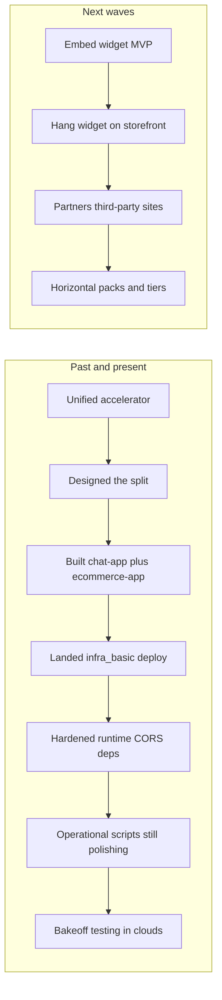

# Product roadmap — from one chatbot to a split fleet, then a drop-in widget

This is the **friendly version**: where we came from, what’s actually done, and where we’re going—without jargon-y phase codes. Dig into details anytime in **[`src/separationPlan.md`](../src/separationPlan.md)** (infra and validation) and **[embeddable-chat-widget-technical-plan.md](embeddable-chat-widget-technical-plan.md)** (how we’d technically build the embeddable bubble).

---

## The story in one picture

Think of this as leveling up:

1. **One big showroom** — a single accelerator where shopping and chat lived together.
2. **Two sibling apps** — shop on one hostname, support chat on another, same family of Azure resources underneath.
3. **A tidy launch routine** — one `azd` story that spins up containers and rebuilds images so nobody’s silently talking to localhost in production.
4. **Proof that it really works** — data in Search/Cosmos, agents happy, clicks and carts tested for real.
5. **Same chat powers, postage-stamp sized** — a widget you can glue onto the shop first, then onto *anyone’s* website later.

---

## Milestones — with honest checkmarks

Legend: **✅ done (as of this roadmap refresh)** · **🔶 in flight / partly there** · **⬜ not started**

| Milestone | Plain-English outcome | Status |
|-----------|-----------------------|--------|
| **Unified customer-chatbot accelerator** | One accelerator story: browse, cart, and AI support in one place so teams could demo the full vibe fast. | ✅ |
| **We agreed how to split the world** | Ecommerce vs. support chat as two products: separate UIs and APIs without pretending they’re the same codebase. Captured in the separation plan. | ✅ |
| **Two real apps with their own front and back ends** | `chat-app/` and `ecommerce-app/` each have `frontend`, `backend`, `infra`, plus forks of scripts you need for standalone deploys. | ✅ |
| **One-shot “everything in Azure” for both apps** | Root `azure.yaml` + `infra_basic/`: shared resource group, one ACR, **four** container sites (both UIs + both APIs), post-deploy script that **`az acr build`**s all images and restarts apps. | ✅ |
| **Production-style wiring that used to bite us** | Hosting uses the real API URL (little `runtime-config.js` handshake), CORS lists **explicit** storefront origins—not `*`—so cookies behave, AcrPull role lines up with what Azure expects today. | ✅ |
| **Containers that match what the code imports** | Chat backend brings the right SDK stack; ecommerce backend installs what `config`/FastAPI actually need so you don’t get mystery import crashes in the cloud. | ✅ |
| **After deploy: fill the pantry (data + AI agents)** | Search indexes seeded, Cosmos has something to chew on, Foundry/agent scripts finish the story—we still run these mostly **manually** or from a playbook; plugging them straight into **`azd up`** is next. | 🔶 |
| **“Yep, humans tried it” sign-off** | Deliberate pass on auth, checkout-adjacent paths, chat threads, `/health`, and unhappy-path errors on **deployed** URLs—not only localhost. Always a moving target but treat as checklist before shouting “done.” | 🔶 |
| **Widget MVP (iframe + skinny loader)** | Tiny **`embed.js`**, **`/widget`** surface in the chat frontend, **`postMessage`** for config—not merging repos, just exporting the chat pane for strangers’ pages. Technical plan spells it out. | ⬜ |
| **Ecommerce storefront runs the widget** | One script snippet (or equivalent) on the shop layout: first real consumer of embeddable chat. | ⬜ |
| **Treat embeds like a product** | Widget keys, allowed origins, good docs for partners, accessibility and perf on the iframe, maybe tiered bells and whistles (e.g. Voice Live gated). | ⬜ |

---

## What “done so far” really means day-to-day

You can tell new teammates:

- **We split the monolith mentally and physically**: shop code and chat code have different front doors.
- **`azd` + infra_basic isn’t aspirational docs**—you can provision, then rely on **`cloud_build_acr`** so all four containers pull fresh tags.
- **The boring sharp edges got sanded**: API URL injection, cookie-safe CORS, registry pull permissions aligned with Azure’s current role IDs, requirements that match Dockerfile reality.

Still **earning the full green check**:

- Turning post-deploy data + agent steps into something that **runs on autopilot right after provisioning** without babysitting prompts.
- A shared **manual or automated QA pass** nobody’s embarrassed to demo to leadership.

---

## Road ahead: embeddable widget (still plain English)

See **[embeddable-chat-widget-technical-plan.md](embeddable-chat-widget-technical-plan.md)** for nerdy depth. Rough order:

1. **Build the postcard version of chat** — same backend routes, fewer pixels, lives in an iframe.
2. **Hand the shop a postage stamp** — drop the loader on ecommerce first; fix whatever auth/CSP whack-a-mole appears.
3. **Open the door to strangers** — other sites, brands, tiers, support matrix.

---

## Beyond ecommerce — how we think about **every other** surface

Retail was the trainer wheels. Past that, reuse the **same Stable Core**, then differentiate with packs and config—not a rewrite each time. The four-layer frame below is straight from how we bucket extensibility (**Stable Core** → **Scenario Packs** → **Configuration Layer** → **Customization Layer**).

### Stable Core (everyone inherits this fun)

Reference architecture templates, scripted deploy, sensible security baseline, and the canonical agents plus base UI—you don’t reinvent the crane for every skylight.

| Building block | What it gives you beyond retail |
|----------------|--------------------------------|
| Reference architecture | Fast PoCs on marketing sites, portals, docs—same skeleton, swap content. |
| Deployment automation | Turnkey spin-up wherever you demo (Azure)—less hand-rolled infra drama. |
| Security baseline | One story for identity, encryption, auditing before you slap chat on HIPAA-ish or messy partner pages. |
| Core agents & default UI | The “actually smart” teammate + Fluent-grade shell—you skin it later. |

### Scenario Packs (“which movie are we in?”)

Predefined flows, canned demo scripts for different personas, data packs layered on indexes, bundles of UI chrome and rule sets, docs that say “here’s how retail differs from IT helpdesk.”

Examples: proactive order-status bot for Shopify; curated FAQ mode for SaaS changelog pages; escalation-to-human playbook for airlines.

### Configuration Layer (“twist knobs, don’t saw wood”)

| Knob | Why it lands outside ecommerce |
|------|-------------------------------|
| Data & schemas | Point search + Cosmos partitions at warranties, telemetry, KB articles—not SKUs. |
| Agent instructions & rules | Rewrite tone: compliance-friendly, cynical developer docs, multilingual support. |
| Integration adapters | CRM, ticketing, Shopify, Slack—swap connectors per vertical without forking git. |
| Optional sub-features | Toggle voice, citations, order lookup, SSO-only mode per tenant SKU. |

### Customization Layer (“when Salesforce demands a hoodie with custom stitching”)

UI/UX extension points (“where your brand hugs ours”), docs for plugging real tenant data feeds, hardened auth narratives, isolated networking when someone needs private endpoints—everything you reach for once a marquee customer insists.

---

---

## Companion docs (when you crave detail)

| Doc | When to crack it open |
|-----|-----------------------|
| [src/separationPlan.md](../src/separationPlan.md) | Infra knobs, **`azd`**, checklist §11 vibes. |
| [embeddable-chat-widget-technical-plan.md](embeddable-chat-widget-technical-plan.md) | iframe loaders, **`postMessage`**, CORS mind-maps. |

---

## Keep us honest (cadence cheat sheet)

| How often | Who | Peek at |
|-----------|-----|---------|
| Monthly | Builders + infra | Containers, scripted post-deploy chores, regressions |
| Six-ish weeks | Product + UX | Widget feel, accessibility, lighthouse-y guilt |
| Quarterly | Biz + alliances | Scenario packs rolling out horizontally, onboarding docs glossy |
