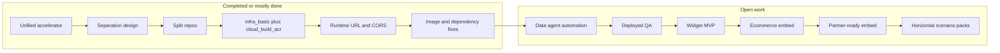
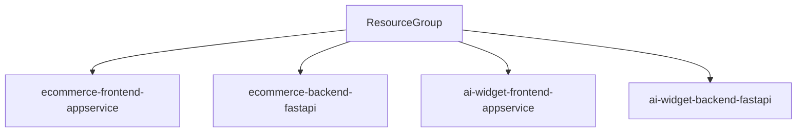

# Product roadmap: unified accelerator → split apps → embeddable widget

High-level sequence and status. Details: [`src/separationPlan.md`](../src/separationPlan.md), [`embeddable-chat-widget-technical-plan.md`](embeddable-chat-widget-technical-plan.md).

**Status:** ✅ complete · 🔶 partial / in progress · ⬜ not started

---

## Sequence

1. Monolithic accelerator (shop + chat in one deploy).
2. Split **`chat-app`** and **`ecommerce-app`** (UI + API per product).
3. Unified Azure deploy (**`infra_basic`**, four container App Services, **`cloud_build_acr`** postprovision).
4. Operational validation: data/agent scripts, QA on hosted URLs.
5. Embeddable widget from chat stack; ecommerce as first host; third-party and non-retail surfaces later.

---

## Milestones

| Milestone | Outcome | Status |
|-----------|---------|--------|
| Unified customer-chatbot accelerator | Single deploy: catalog, cart, conversational support; Azure Search / Cosmos / Foundry baseline. | ✅ |
| Separation design | Ecommerce vs support chat as separate products; documented in separation plan. | ✅ |
| **`chat-app`** / **`ecommerce-app`** layout | Each includes **`frontend/`**, **`backend/`**, **`infra/`**; per-app script copies for standalone **`azd`**. | ✅ |
| Unified **`infra_basic`** + **`azure.yaml`** | One resource group, ACR, four sites; postprovision builds four images and restarts all four web apps. | ✅ |
| Hosted config and CORS | Frontends load **`runtime-config.js`** for API base URL; backends use explicit **`ALLOWED_ORIGINS_STR`** (no **`*`** with credentialed clients). | ✅ |
| Container images match code | Chat and ecommerce **`requirements.txt`** aligned with imports; AcrPull uses current built-in role GUID. | ✅ |
| Post-deploy data and agents | **`infra/scripts/data_scripts/`** + **`agent_scripts/`**; still mostly manual / runbook—automation after **`azd up`** open. | 🔶 |
| Deployed QA sign-off | Auth, ecommerce flows, chat messaging, **`/health`**, error handling on production hostnames. | 🔶 |
| Widget MVP | Script loader + Shadow DOM widget bundle; same chat API contract with SSE streaming. See technical plan. | ⬜ |
| Ecommerce embeds widget | Script or layout integration on **`ecommerce-app`** pointing at hosted loader. | ⬜ |
| Embed as product | Tenant keys, origin allowlist, partner docs, iframe a11y/perf, optional feature tiers (e.g. Voice Live). | ⬜ |

---

## Embed program (order of work)

1. Build widget frontend with React + Fluent UI using Vite library mode (`widget.js` output).
2. Implement script-loader embed with Shadow DOM isolation as default.
3. Host widget and backend on Azure App Service; keep FastAPI as API surface.
4. Integrate on ecommerce frontend using one script include + `ChatWidget.init(...)`.
5. Add iframe variant only if host-site CSS isolation or policy constraints require it.
6. Expand to third-party origins and partner docs after ecommerce validation.

### Preferred implementation defaults (demo accelerator)

| Area | Default |
|------|---------|
| Widget UI | React + Fluent UI |
| Build output | Vite library bundle (`widget.js`) |
| Embed method | Script loader + Shadow DOM |
| Backend | FastAPI |
| Streaming | SSE |
| Hosting | Azure App Service |
| Isolation fallback | iframe only if needed |

### Avoid in initial phase

- Multi-tenant platform design.
- Web PubSub / WebSockets-first transport.
- Microservices split for widget scope.
- CDN / Front Door layering unless a concrete need appears.
- Complex auth and distributed session patterns.

---

## Beyond ecommerce (extensibility model)

Same **Stable Core**, then **scenario** and **configuration** differentiation—avoid per-vertical rewrites.

### Stable Core

| Item | Role |
|------|------|
| Reference architecture | Repeatable template for new PoCs / verticals. |
| Deployment automation | **`azd`**, Bicep, image build hooks. |
| Security baseline | Identity, secrets, network defaults. |
| Core agents and base UI | Foundry/agents + Fluent shell shared across scenarios. |

### Scenario Packs

Flow templates, demo scripts, data packs / index overlays, bundled rules and UI variants, industry-specific extension notes (e.g. retail vs. internal support).

### Configuration Layer

Custom data / schemas, agent instructions and policy rules, integration adapters (CRM, ticketing, storefronts), toggleable sub-features per tenant or SKU.

### Customization Layer

UI/UX integration points, tenant data wiring guides, auth/security runbooks, production network isolation where required.

---





Embed contract on ecommerce:

```html
<script src="https://ai-widget-frontend.azurewebsites.net/widget.js"></script>
```

Optional single-app variant for fastest demo iteration:

```text
ai-widget-fastapi-appservice
  -> serves /widget.js and /assets/*
  -> serves /api/chat (SSE)
```

---

## Related documents

| Document | Use |
|----------|-----|
| [`src/separationPlan.md`](../src/separationPlan.md) | Infrastructure, **`postprovision`**, §11 validation. |
| [`embeddable-chat-widget-technical-plan.md`](embeddable-chat-widget-technical-plan.md) | Shadow DOM embed, FastAPI/SSE, CORS, packaging. |

---

## Review cadence

| Frequency | Audience | Focus |
|-----------|----------|--------|
| Monthly | Engineering, platform | Releases, **`azd`**, hooks, regressions |
| Six weeks | Product, UX | Widget UX, accessibility, performance budgets |
| Quarterly | Partnerships | Scenario packs, onboarding, non-retail rollout |
