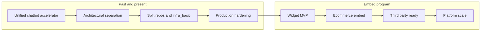

# Customer chatbot: product roadmap (unified accelerator to embeddable widget)

Readable milestone view from the **single** accelerator through **split apps**, then an **embeddable chat widget** reusable beyond ecommerce.

| Doc | Purpose |
|-----|---------|
| [src/separationPlan.md](../src/separationPlan.md) | Separation architecture, infra, validation |
| [embeddable-chat-widget-technical-plan.md](embeddable-chat-widget-technical-plan.md) | Widget engineering (iframe, CORS, build targets) |

## High-level timeline

---

## Milestone summary

| ID | Milestone | Outcome |
|----|-----------|---------|
| **R0** | **Baseline unified customer chatbot** | Single SPA + API: shop + assistant in one deploy; Cosmos, Search, Foundry wired; **`azd up`** baseline for accelerator customers. |
| **R1** | **Architectural separation** | Two bounded contexts (**ecommerce**, **support chat**) documented; shared infra patterns identified (Cosmos containers, indexes, identities). |
| **R2** | **Split chat-app and ecommerce-app** | Separate frontends/backends/repos layout; **`infra_basic`** provisions **four** container sites + ACR; postprovision **`cloud_build_acr`**; runtime **`VITE_API_BASE_URL`** + CORS parity. |
| **R3** | **Split-stack production readiness** | Data scripts + agent scripts after deploy (automate or documented); **`/health`**, browser acceptance on both stacks; **`separationPlan.md`** checkpoints closed for your environment. |
| **R4** | **Embed program starts: widget MVP** | **`/widget`** + **`embed.min.js`** (iframe); **`postMessage`** config; parity with **`/api/chat`** for text path; versioning and error UX. Technical detail: **[embeddable-chat-widget-technical-plan.md](embeddable-chat-widget-technical-plan.md)**. |
| **R5** | **Ecommerce consumes widget** | **ecommerce-app** adds **script tag / layout hook** pointing at hosted loader; SSO or anonymous flows validated; CSP allowlist documented. |
| **R6** | **Third-party and multi-brand** | Public embed (**widget key**, origin allowlists, optional JWT/session API); CSP **`frame-ancestors`** catalog; Lighthouse and accessibility pass for iframe surface. |
| **R7** | **Beyond ecommerce (horizontal)** | SaaS playbook: partner CMS (WordPress/Webflow/SFCC), authenticated B2B portals, internal IT helpdesk, docs sites—same loader, **tenant** maps to policy + Cosmos partition; Voice Live entitlement by tier; analytics export for CS leadership. |

---

## Phase narratives

### Phase A — Unified customer chatbot (R0)

**Goal.** One accelerator delivers **browse + cart + conversational support** so customers evaluate AI on real retail flows.

**Exit criteria.**

- **`azd up`** deploys workable UI and API stack (monolith-era or early split acceptable for your freeze date).
- Search + Cosmos data path documented for POC demos.

---

### Phase B — Split chat-app and ecommerce-app (R1–R2)

**Goal.** Teams can ship, secure, and scale **shop** independently from **support**, while sharing infra where it makes economic sense (**unified **`infra_basic`**** or per-app stacks).

**Exit criteria.**

- Four App Services (+ ACR) with correct images; fronts call correct APIs (**runtime-config**, no wildcard CORS with credentials).
- AcrPull and application settings validated (**§11** style checks in **`separationPlan.md`**).

---

### Phase C — Run and prove both apps (R3)

**Goal.** Operators complete **indexes, seed data, agents**; QA signs off on **critical user journeys**.

**Exit criteria.**

- Data + agent pipelines run after provision (automated hooks or repeatable runbooks).
- Ecommerce catalog/cart/order smoke tests; chat session + messaging (voice optional).

---

### Phase D — Embed: build the widget surface (R4)

**Goal.** Consumers get a **hosted chat bubble** sourced from chat-app—not a merger with ecommerce SPA.

**Exit criteria.**

- Loader + iframe + narrow widget bundle documented in technical plan §8 M1–M2.
- API ready for iframe origin and any first **embed allowlist**.

---

### Phase E — Embed in ecommerce, then everywhere (R5–R7)

**Goal.** **ecommerce-app** is the **first integration** only; roadmap explicitly expands to **arbitrary hosts**.

**Representative expansions.**

| Use case | What differs |
|---------|----------------|
| **Retail ecommerce** | Product context injected via **`postMessage`** (SKU, locale); optional escalation to cart handoff Deep Link. |
| **Brand marketing site** | Lead capture focus; simpler policies; GDPR consent banner coupling. |
| **Docs / developer portal** | Pre-indexed content in Search; citations in widget; SSO with GitHub/email. |
| **B2B partner portal** | Strong JWT + tenant id; SLA-oriented routing to human queue. |

**Exit criteria.**

- Partner onboarding doc: origins, CSP snippet, **`X-Widget-Key`**, support matrix (browsers).
- Telemetry dashboards split **hosted SPA** vs **embed** (`embed.request_id`).

---

## How to read this with engineering backlogs

- Map **epics** to **R4–R7** UI/SDK/API/infra increments.
- Keep **technical plan** as source for ADRs (embedding model, auth, postMessage versioning).
- Revisit **`separationPlan.md`** when infra touches **ALLOWED_ORIGINS**, new hostnames (**widget** subdomain), or new outputs for embed keys.

---

## Review cadence (suggestion)

| Horizon | Audience | Focus |
|---------|----------|--------|
| Monthly | Engineering + infra | R2–R3 stability; script automation |
| Bi-monthly | Product + UX | R4 UX, accessibility, Lighthouse |
| Quarterly | Partnerships | R6–R7 vertical playbooks |
