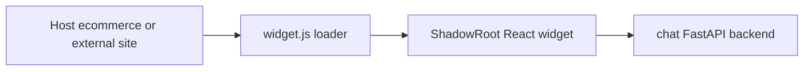

# Technical plan: embeddable Chat widget (chat-app origins, any-host embed)

This document specifies how to deliver a **small, embeddable client** sourced from **chat-app** capabilities, **without merging** chat and ecommerce repos. Host sites (starting with ecommerce-app, later arbitrary domains) load the widget the same way a third-party would.

Product milestones and roadmap context live in **[customer-chatbot-product-roadmap.md](customer-chatbot-product-roadmap.md)**.

## 1. Objectives

- One **distribution artifact** developers can paste into arbitrary HTML (script embed).
- **Runtime configuration** only (API base URL, optional tenant/widget id, theme tokens). No compile-time coupling to ecommerce-app.
- **Security-first**: predictable CORS/auth story, CSP-friendly embedding options, minimized XSS surface.
- **Parity**: reuse chat backend routes already used by full chat SPA (`/api/chat/*`, auth, Voice Live where applicable).
- **Simplicity first**: architecture optimized for demo velocity on Azure App Service.

## 2. Non-goals

- Folding chat UI into ecommerce-app bundles or importing ecommerce source into chat.
- Replacing the full-screen chat SPA except as a **standalone** fallback for unsupported browsers or iframe-blocked contexts.
- Designing full multi-tenant control planes in initial release.
- Introducing Web PubSub, microservices, AKS, Front Door, or distributed session architecture for MVP.

## 3. Embedding model (recommended stack)

Default to one pattern and keep one fallback.

### 3.1 Primary: script loader + Shadow DOM (recommended)

| Concern | How it is addressed |
|--------|----------------------|
| **CSS isolation** | Widget mounts inside a Shadow Root to isolate host CSS and reduce style collisions. |
| **Embed simplicity** | Host adds one script include and calls `ChatWidget.init(...)`. |
| **Debugging** | Single-window runtime avoids cross-window message inspection for initial MVP. |
| **Versioning** | `widget.js` path/version controls rollout; host integration remains stable. |

**Mechanics**

1. Host page loads `https://<widget-host>/widget.js`.
2. `widget.js` creates a host node, attaches Shadow Root, and mounts React app.
3. Widget calls FastAPI APIs on same origin or configured `apiBaseUrl`.

Reference shape:

```text
class ChatWidget {
  init() {
    const host = document.createElement("div")
    document.body.appendChild(host)
    const shadowRoot = host.attachShadow({ mode: "open" })
    createRoot(shadowRoot).render(<App />)
  }
}
window.ChatWidget = new ChatWidget()
```

### 3.2 Fallback: iframe loader (only when required)

Use iframe only if a target host has blocking CSS/policy behavior that Shadow DOM cannot address safely.

## 4. Frontend architecture



**Frontend build targets**

- **Vite library mode** for `widget.js` bundle.
- React + Fluent UI component tree focused on floating launcher + panel.
- No full SPA routing for widget package.

Example embed API:

```html
<script src="https://my-widget.azurewebsites.net/widget.js"></script>
<script>
  ChatWidget.init({
    apiBaseUrl: "https://my-widget.azurewebsites.net",
    theme: "light"
  });
</script>
```

## 5. Backend and CORS contract

Widget backend remains FastAPI.

Primary API scope:

- `POST /api/chat` or streaming equivalent.
- Azure OpenAI orchestration.
- Session state for active widget conversation.

Streaming recommendation:

- Use SSE first (`EventSourceResponse`) instead of WebSockets.
- Keep protocol simple for incremental token streaming.

CORS:

- Explicit host allowlist only.
- No wildcard `*` for credentialed flows.

## 6. Observability and operations

- Widget requests carry **`rid=`** correlation id propagated to OTel **`embed.request_id`**.
- Feature flags (`widget.voice_live.enabled`) backend-driven to avoid mismatched UX.

## 7. Packaging and delivery

| Artifact | Host |
|----------|------|
| `widget.js` | App Service static path (preferred for MVP) |
| static assets (`/assets/*`) | Same App Service as widget backend or widget frontend |
| Integrity | **`SRI hash`** published in README + changelog |

Semantic versioning **`MAJOR`** for breaking **`postMessage`** or config schema.

### Deployment options

Preferred for fastest demo loop:

```text
ai-widget-fastapi-appservice
  -> /widget.js
  -> /assets/*
  -> /api/chat (SSE)
```

Alternative (keep current four-app split):

```text
ResourceGroup
  -> ecommerce-frontend-appservice
  -> ecommerce-backend-fastapi
  -> ai-widget-frontend-appservice
  -> ai-widget-backend-fastapi
```

## 8. Milestones (technical)

Sequencing aligns with later roadmap milestones (**Embed widget MVP** onward) in [customer-chatbot-product-roadmap.md](customer-chatbot-product-roadmap.md).

### M1 Widget shell

- Vite library build for `widget.js`.
- Shadow DOM mount + floating launcher/panel UX.
- Script embed + `ChatWidget.init({ apiBaseUrl, theme })`.

### M2 Backend hardening for third-party origins

- SSE endpoint for streamed responses.
- Explicit origin allowlist and simplified token/session flow.
- Keep auth straightforward for accelerator demo scope.

### M3 ecommerce-app integration PoC

- Add script include to **`ecommerce-app/frontend`** and initialize widget.
- Validate CSS isolation, mobile behavior, and focus/keyboard interactions.

### M4 Polish and CDN

- SRI, minified bundle, Lighthouse budget, error boundary UX.
- Introduce iframe variant only if required by host constraints.

### M5 Extensions

- Optional tenant mapping, partner snippets, and advanced entitlements.
- Defer distributed auth/session patterns until scale requires them.

## 9. Risks and mitigations

| Risk | Mitigation |
|------|------------|
| Host CSS affects widget | Shadow DOM by default. |
| Cookie SameSite failures | Prefer simple token/session flow; avoid cross-site cookie dependence for MVP. |
| Style drift | Single Fluent theme manifest shared between SPA and widget build (shared token JSON if needed). |

## 10. References in repo

- Chat UI entry: [`chat-app/frontend`](../chat-app/frontend)
- Separation context: [`src/separationPlan.md`](../src/separationPlan.md)
- Cloud deploy / CORS: [`infra_basic/main.bicep`](../infra_basic/main.bicep) app settings
