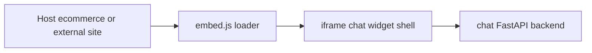

# Technical plan: embeddable Chat widget (chat-app origins, any-host embed)

This document specifies how to deliver a **small, embeddable client** sourced from **chat-app** capabilities, **without merging** chat and ecommerce repos. Host sites (starting with ecommerce-app, later arbitrary domains) load the widget the same way a third-party would.

Product milestones and roadmap context live in **[customer-chatbot-product-roadmap.md](customer-chatbot-product-roadmap.md)**.

## 1. Objectives

- One **distribution artifact** developers can paste into arbitrary HTML (**script + optional tag** pattern).
- **Runtime configuration** only (API base URL, optional tenant/widget id, theme tokens). No compile-time coupling to ecommerce-app.
- **Security-first**: predictable CORS/auth story, CSP-friendly embedding options, minimized XSS surface.
- **Parity**: reuse chat backend routes already used by full chat SPA (`/api/chat/*`, auth, Voice Live where applicable).

## 2. Non-goals

- Folding chat UI into ecommerce-app bundles or importing ecommerce source into chat.
- Replacing the full-screen chat SPA except as a **standalone** fallback for unsupported browsers or iframe-blocked contexts.

## 3. Embedding models (recommended stack)

Three patterns are commonly used; pick **one primary** and document fallback.

### 3.1 Primary: iframe + thin loader script (recommended)

| Concern | How it is addressed |
|--------|----------------------|
| **CSP / JS isolation** | Parent page CSP does not execute widget JS if policy is tight; **`iframe`** with **`src`** on **`https://chat-host/...`** uses **chat-origin** CSP. |
| **Cookie / SSO** | Session cookies scoped to **`chat-host`** simplify Easy Auth flows inside iframe; cross-site cookies avoided on parent unless explicitly needed. PostMessage notifies parent (`widget:ready`, `widget:opened`). |
| **Versioning** | iframe URL includes **`w=semver`** query or path segment; cache-bust CDN for loader only. |

**Mechanics**

1. **Loader** (~2–6 KB gzipped): `https://widgets.<chat-brand>/chat-loader/v1/embed.js`.
2. Loader injects **`iframe`** positioned fixed bottom-right (`position`, `z-index`, `sandbox` tuned for needed capabilities).
3. iframe loads **`https://app-chat-...azurewebsites.net/widget`** (or CDN static HTML) served from **same deploy as chat SPA** but a **narrow route**/`/widget` shell that mounts only **`ChatSurface`** subtree.

`sandbox`: start with restrictive set; extend only when mic/WebRTC Voice Live demands (`allow-same-origin` + **`allow-microphone`** as needed).

### 3.2 Secondary: Shadow DOM Web Component (`<support-chat-widget>`)

- Loads same bundle as SPA chunk but attaches under shadow root for style isolation on **first-party-only** embeddings where CSP allows inline component registration.
- **Third-party** hosts often struggle with CSP for custom elements unless they allowlists your script URI; iframe remains default for SaaS breadth.

### 3.3 Not default: script-only DIV mount

Full React tree in host DOM exposes **CSS leakage** and **global polyfill** clashes; reserve for trusted first-party integrations only.

## 4. Frontend architecture



**New build targets in chat-app frontend** (conceptual):

- **`widget` entry**: Vite **`build.lib`** or second **`rollupOptions.input`** exporting only chat panel + minimized chrome (Fluent as today).
- **`/widget`** route or static **`widget/index.html`** for iframe bootstrap (minimal HTML, **`runtime-config.js`** pattern reused; query params **`?api=`** discouraged—prefer **`postMessage`** after load so secrets stay server-side props only where needed).

**PostMessage schema** (versioned envelope):

```text
type ChatWidgetEnvelope = {
  v: 1;
  channel: "contoso-chat-widget";
  payload: KnownPayload;
};
```

Events: **`config:apply`**, **`open`**, **`close`**, **`height:report`**, **`auth:hint`** (opaque token refs only).

## 5. Backend and CORS contract

Today's chat SPA uses **`withCredentials: true`**. Embed flow requires:

1. **`ALLOWED_ORIGINS_STR`** must explicitly list **`https://ecommerce-front...`** **and** the **iframe-document origin** (`https://app-chat...`) if API calls originate from iframe (same-origin to API if widget is subdomain of API—preferred: **same site** `widget.chat.company` ↔ `api.chat.company` with shared cookies).
2. For **foreign** hosts (`https://partner.com`): either
   - **Public embed mode** — anonymous/session token issued by **`POST /api/embed/session`** (short-lived JWT in memory, no cookie), **or**
   - **PKCE SPA** hosted in iframe obtains tokens; API validates JWT `aud`/`iss`; CORS **`Access-Control-Allow-Origin`** echoes **explicit** **`https://partner.com`** (never **`*`** with credentials).

**Implementation slice**

- Add **`WidgetSettings`** derived from **`Origin`** + **`X-Widget-Key`** (server-side registry in Cosmos or KV) returning **conversation namespace** and **policy profile**.
- Extend FastAPI **`CORSMiddleware`** origins from config (comma list already exists).

## 6. Observability and operations

- **iframe** URLs carry **`rid=`** correlation id propagated to OTel **`embed.request_id`**.
- Feature flags (`widget.voice_live.enabled`) backend-driven to avoid mismatched UX.

## 7. Packaging and delivery

| Artifact | Host |
|----------|------|
| `embed.min.js` | Azure Blob + CDN Front Door OR path on chat frontend static nginx |
| `widget.html` bundle | Same App Service/site as chat frontend |
| Integrity | **`SRI hash`** published in README + changelog |

Semantic versioning **`MAJOR`** for breaking **`postMessage`** or config schema.

## 8. Milestones (technical)

Sequencing aligns with later roadmap milestones (**Embed widget MVP** onward) in [customer-chatbot-product-roadmap.md](customer-chatbot-product-roadmap.md).

### M1 Widget shell

- Vite **`/widget`** HTML + Fluent chat subtree (read-only transcripts optional).
- **Loader** iframe injection + **`postMessage`** `config:apply` with **`apiBaseUrl`** from host (or fixed prod URL).

### M2 Backend hardening for third-party origins

- Embeddable **session** or JWT path; Cosmos partition by **`widgetTenantId`**.
- CSP / CORS allowlist surfaced in infra (`ALLOWED_EMBED_ORIGINS` or reuse **`ALLOWED_ORIGINS_STR`** with documented comma list).

### M3 ecommerce-app integration PoC

- Single script tag on **`ecommerce-app/frontend`** layout; QA matrix: Chrome/Safari, strict CSP ecommerce template.

### M4 Polish and CDN

- SRI, minified loader, Lighthouse budget (TTI), error boundary UX in iframe (`widget:crash`).

### M5 Extensions

- Multi-tenant key mapping, SSO bridge, Shopify/Webflow snippets (same loader), Voice Live gated by entitlement.

## 9. Risks and mitigations

| Risk | Mitigation |
|------|------------|
| iframe blocked by **`X-Frame-Options`** on chat SPA | Dedicated **`widget.`** subdomain; use CSP **`frame-ancestors`** allowlist embed partners. |
| Cookie SameSite failures | Prefer **JWT-in-memory** for cross-site embed; keep Easy Auth iframe session on chat origin. |
| Style drift | Single Fluent theme manifest shared between SPA and widget build (shared token JSON if needed). |

## 10. References in repo

- Chat UI entry: [`chat-app/frontend`](../chat-app/frontend)
- Separation context: [`src/separationPlan.md`](../src/separationPlan.md)
- Cloud deploy / CORS: [`infra_basic/main.bicep`](../infra_basic/main.bicep) app settings
